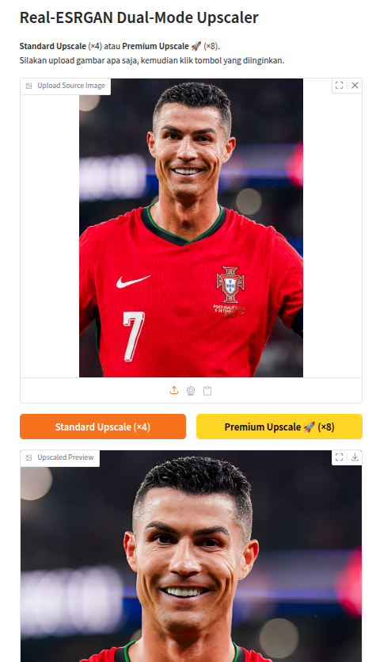

# 🖼️ Real-ESRGAN Dual-Mode Image Upscaler

A lightweight Gradio web app to upscale any image using the Real-ESRGAN model. Simply upload your photo, choose either **Standard Upscale** (×4) or **Premium Upscale** (×8), and download the upscaled image.


---

## 📑 Table of Contents

1. [Features](#features)  
2. [Project Structure](#project-structure)  
3. [Prerequisites](#prerequisites)  
4. [Installation](#installation)  
5. [Running Locally](#running-locally)  
6. [Usage](#usage)  
7. [Contributing](#contributing)  
8. [License](#license)  
9. [Author & Credits](#author--credits)

---

## ✨ Features

- **Standard Upscale (×4)**  
  Enhance image resolution by 4x for clearer and larger images.

- **Premium Upscale (×8)**  
  Upscales first to 4x and then resizes using bicubic interpolation for even higher resolution (8x).

- **Live Preview**  
  See your original and upscaled images side by side before downloading.

- **Instant Download**  
  Export the upscaled image as a PNG and use it immediately.

<p align="center">
  
</p>

---


## 📁 Project Structure

```
upscale-project/
├── model/
│ └── Real-ESRGAN-x4plus.onnx # ONNX model for upscaling
├── app.py # Main application file
├── requirements.txt # List of Python dependencies
├── .gitignore # Git ignore file to exclude unnecessary files
├── LICENSE # License file for the project
└── README.md # Project documentation
```

---


---

## ⚙️ Prerequisites

- Python 3.10 or higher  
- `git`  
- A terminal / command prompt  

---

## 🔧 Installation

1. Clone this repository:

   ```bash
   git clone https://github.com/salmanalfarisi11/Upscaler_images.git
   cd Upscaler_images
   ```

2. Create and activate a virtual environment:

   ```bash
    python -m venv .venv
    source .venv/bin/activate   # Linux/macOS
    .venv\Scripts\activate      # Windows
   ```

3. Install dependencies:

   ```bash
   pip install -r requirements.txt
   ```

## 🚀 Running Locally

Launch the app on your machine:
   ```bash
   python app.py
   ```
By default, it will start on http://127.0.0.1:7860/. Open that URL in your browser to access the interface.

## 🎯 Usage

1. **Upload Photo** via the left panel.  
2. **Choose a Mode**:  
   - Click **Standard Upscale (×4)** for a 4x resolution increase. 
   - Click **Premium Upscale (×8)** for an 8x resolution increase.
3. Preview your result on the right side. 
4. Click **Download PNG** to save the upscaled image.


## 🤝 Contributing
Contributions, bug reports, and feature requests are welcome! Feel free to open an issue or submit a pull request.


## 📄 License

This project is licensed under the [MIT License](LICENSE).

---

## 🖋️ Author & Credits

Developed by **[Salman Alfarisi](https://github.com/salmanalfarisi11)** © 2025  
- GitHub: [salmanalfarisi11](https://github.com/salmanalfarisi11)  
- LinkedIn: [salmanalfarisi11](https://linkedin.com/in/salmanalfarisi11)  
- Instagram: [faris.salman111](https://instagram.com/faris.salman111)  

Built with ❤️ and Gradio
Feel free to ⭐ the repo and share feedback!

## Acknowledgements
This project uses the Real-ESRGAN model developed by Xintao Wang.
The model is available under the BSD 3-Clause License.